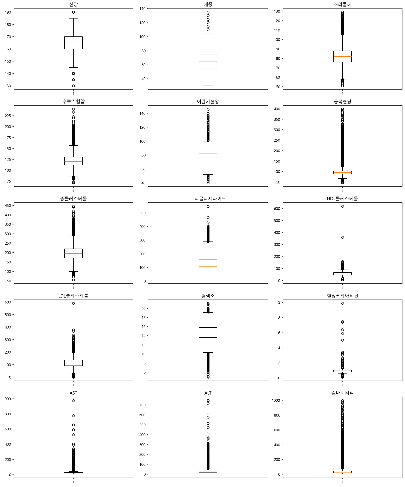
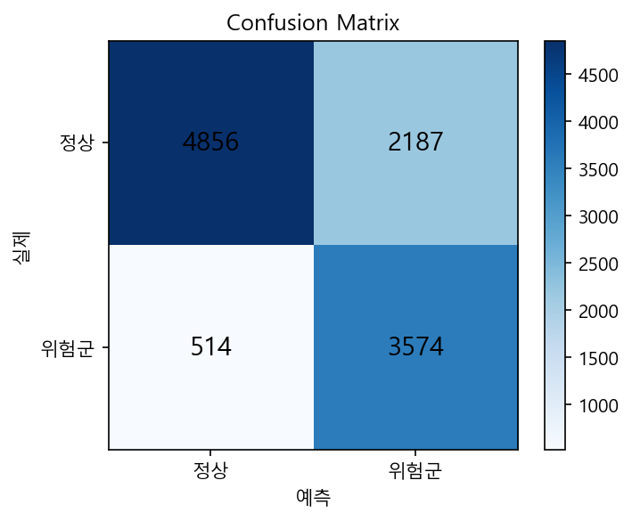
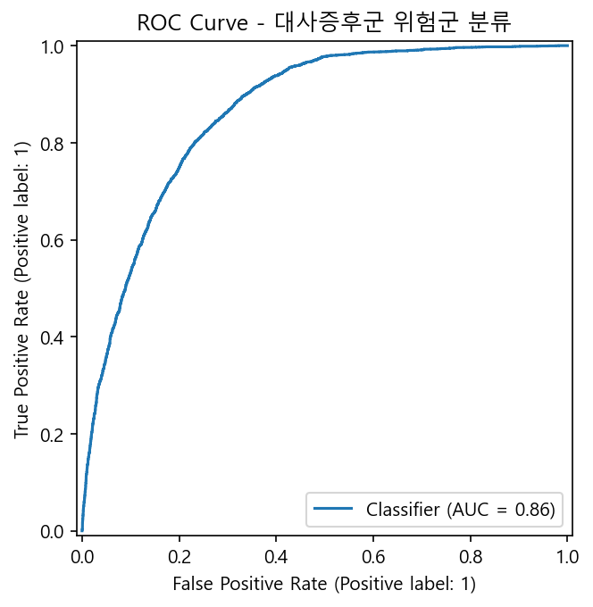
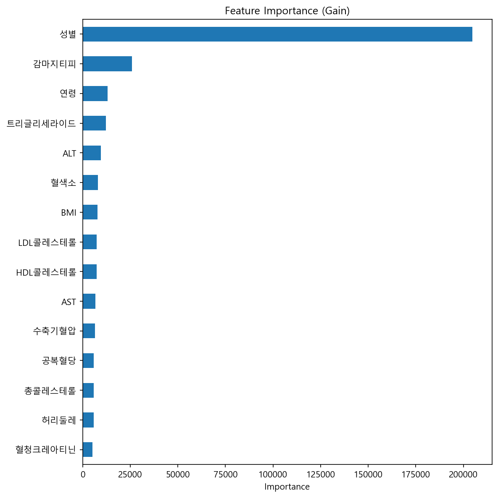
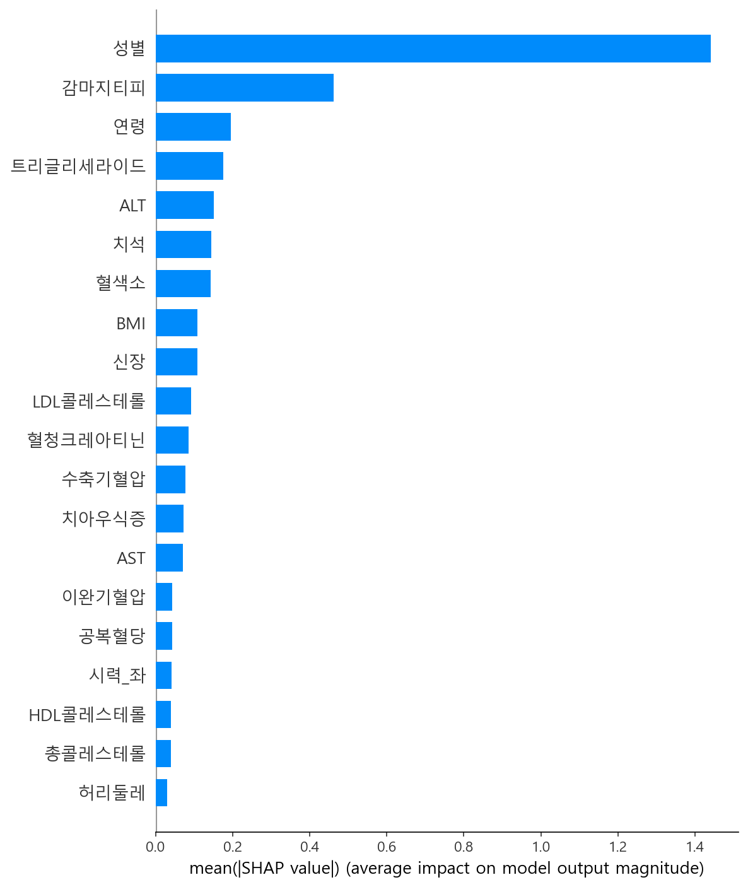
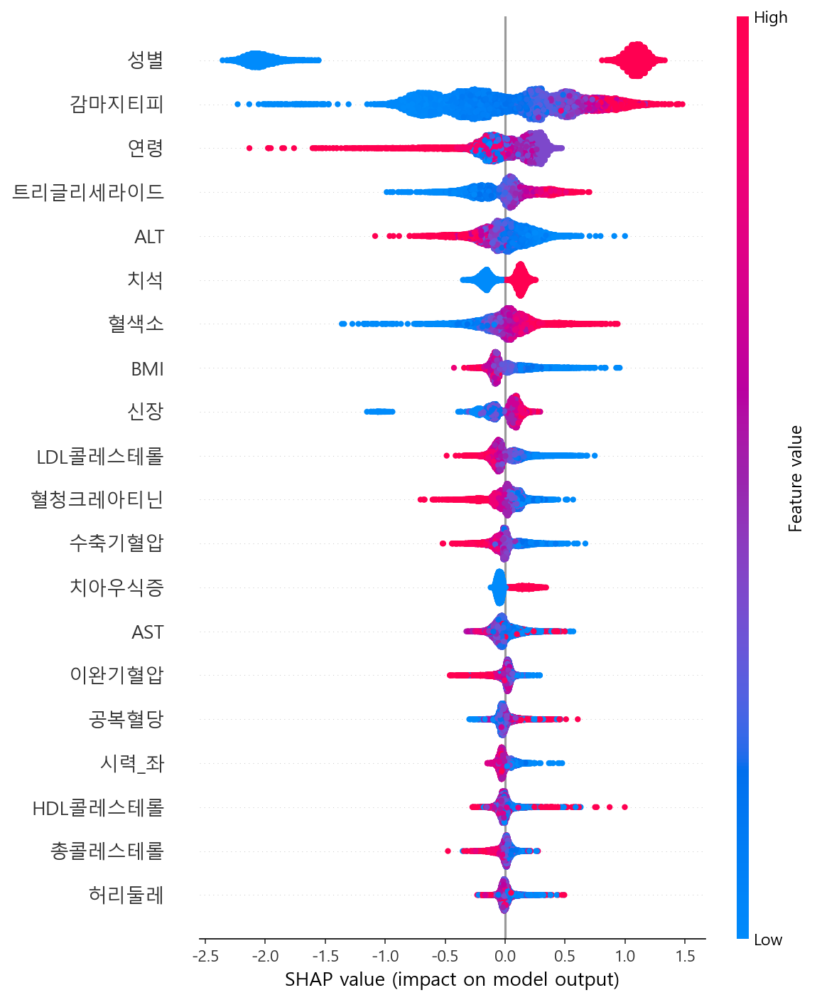
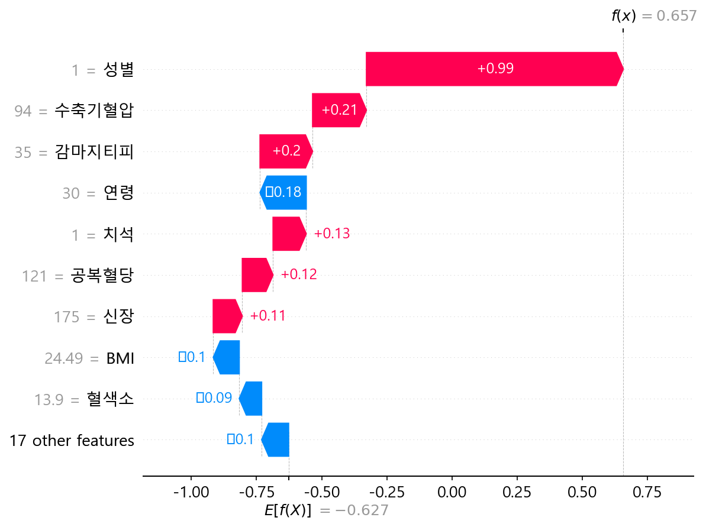

## 건강검진 AI 파이프라인 | Health Checkup AI Pipeline

> **검진 수치 → 설명 가능한 AI 예측 → 자연어 리포트, End-to-End 자동화**

> **"예측 정확도"보다 "설명 가능성 + 사용자 이해"를 우선한 AI**

> **Checkup numbers → explainable AI prediction → natural-language report, fully automated end-to-end.**

## 🔄 Before vs After
- ❌ Before: 숫자와 의학 용어 중심 → 사용자가 직접 해석
- ✅ After: AI가 원인까지 설명하는 자연어 리포트 자동 생성

---

### 📌 문제 정의 | Problem

건강검진 결과지는 숫자와 의학 용어(예: `감마지티피 62`, `LDL 151`)로만 제공되어, 검진 항목이 무엇을 의미하는지, 어떤 항목이 왜 위험한지 일반 사용자가 스스로 해석하기 어렵습니다. 또한 모델이 "위험" 판정을 내려도 그 근거가 블랙박스로 남으면 신뢰하기 어렵습니다.

Health-checkup results are handed back as raw numbers and medical jargon (e.g., `Gamma-GTP 62`, `LDL 151`), which are hard for a non-expert to interpret. And even when a model flags "risk," an unexplained black-box verdict is hard to trust.

**왜 하필 "흡연"을 예측 타겟으로 잡았는가**: 흡연 여부는 간수치·혈중지질·혈압 등 다양한 검진 지표에 폭넓게 영향을 주는 대표적인 생활습관 변수입니다. 그래서 "검진 수치 패턴만으로 생활습관 위험 신호를 얼마나 잘 잡아낼 수 있는가"를 검증하는 대표 타겟으로 적합하다고 판단했고, 이 구조는 흡연 대신 대사증후군·고혈압 등 다른 라벨로도 그대로 교체 가능합니다.

**Why smoking as the prediction target**: Smoking status is a lifestyle variable with broad downstream effects on liver enzymes, blood lipids, and blood pressure — making it a strong stand-in for testing "how well can checkup-measurement patterns alone surface a lifestyle risk signal." The same pipeline structure can be re-targeted to other labels (metabolic syndrome, hypertension, etc.) without redesign.

### 💡 해결 방법 | Approach

1. **표준화**: 원본 검진 데이터를 일관된 스키마로 정제
2. **예측 + 설명**: LightGBM으로 위험 패턴을 분류하고, SHAP으로 "어떤 수치가 왜" 그 판정에 기여했는지 항목별로 분해
3. **자연어 변환**: SHAP 상위 요인 + 임상 정상범위 기준을 결합해, 외부 LLM API 없이 규칙 기반으로 사람이 읽을 수 있는 소견문 생성

1. **Standardize** raw checkup data into a consistent schema
2. **Predict + explain**: classify risk patterns with LightGBM, then decompose *which* measurement contributed *how much and in what direction* using SHAP
3. **Translate to language**: combine top SHAP factors with clinical reference ranges into a rule-based (no external LLM API) natural-language report

---

### 📌 Overview | 개요

| | |
|---|---|
| **개발 인원 / Team** | 1인 개인 프로젝트 (기획~서빙 전 과정 100% 단독 수행) / Solo project — 100% ownership from planning to delivery |
| **데이터 / Data** | 국민건강보험공단 건강검진 데이터, 약 55,694건 / Korean National Health Insurance checkup dataset, ~55,694 records |
| **기술 스택 / Tech Stack** | Python · Pandas · NumPy · Matplotlib · Scikit-learn · LightGBM · SHAP |
| **핵심 지표 / Key Metrics** | Accuracy 0.757 · F1 0.726 · **AUC 0.863** · Recall(위험군) 0.87 |

---

### 💡 활용 가능 시나리오 | Use Cases

이 파이프라인은 "예측 → 설명 → 자연어화"라는 구조 자체가 재사용 가능하도록 설계되어, 타겟 라벨만 바꾸면 다음과 같은 서비스에 그대로 응용할 수 있습니다.

The predict → explain → narrate structure is reusable — swapping the target label alone lets it plug into services like:

- **건강검진 앱**: 검진 결과 업로드 시 자동으로 요약 소견 생성 / Consumer health apps auto-generating a plain-language summary from uploaded results
- **보험사 리스크 평가**: 언더라이팅 심사 보조용 설명 가능한 위험도 스코어링 / Insurance underwriting — an explainable risk score to support (not replace) manual review
- **병원 EMR 보조 시스템**: 의료진에게 수치 이상 패턴을 요약해 보여주는 1차 스크리닝 도구 / Hospital EMR add-on that pre-summarizes abnormal patterns for clinicians as a first-pass screening aid

---

### 🏗 아키텍처 | Architecture

```
[원본 데이터 CSV, 55,694건]  Raw CSV data
        │
        ▼
[01_preprocessing.ipynb]
  컬럼명 영→한 표준화 / 결측치·이상치 처리 / BMI·대사증후군 파생변수 생성
  Column standardization (EN→KR) · missing/outlier handling · derived features (BMI, metabolic syndrome score)
        │
        ▼
[processed.csv, 55,653건]
        │
        ▼
[02_modeling.ipynb]
  LightGBM 분류 모델 학습 (흡연여부 예측) + scale_pos_weight 클래스 불균형 보정 + SHAP 설명
  LightGBM classification (smoking prediction) + class-imbalance correction + SHAP explainability
        │
        ▼
[03_llm_report_gen.ipynb]
  SHAP 상위 요인 + 정상범위 기준표 결합 → 규칙 기반 자연어 소견 생성
  SHAP top factors + reference-range rules → rule-based natural-language report generation
        │
        ▼
[결과 리포트 sample_reports.csv]  Generated clinical-style reports
```

#### 기술 선정 사유 | Why These Tools

| 기술 | 선정 사유 (KR) | Rationale (EN) |
|---|---|---|
| **LightGBM** | 정형 데이터 분류에서 빠르고 안정적인 성능, 결측치 처리 용이, SHAP과 호환성 우수 | Fast, stable performance on tabular data; handles missing values natively; strong SHAP compatibility |
| **SHAP** | 모델 예측 근거를 변수별로 분해해 투명하게 설명 가능 | Decomposes predictions feature-by-feature for transparent explainability |
| **규칙 기반 소견 템플릿** | 외부 API 비용 없이 SHAP 결과를 자연어 소견으로 변환, 설명가능성 확보 | Converts SHAP output into natural language without external API cost, while keeping full explainability |

---

### 🔍 파이프라인 상세 | Pipeline in Detail

#### 1️⃣ 데이터 표준화 (`01_preprocessing.ipynb`)
- 영문 컬럼명 → 한글 표준명 매핑 (예: `fasting blood sugar` → `공복혈당`)
- 시력 `9.9`(미측정 코드) → 결측치 처리
- 혈압·혈당·간수치 등 **의학적으로 불가능한 이상치 제거** (55,694 → 55,653건, 41건 제거)
- `BMI`, 대사증후군 판정 5개 기준(허리둘레·혈압·혈당·중성지방·HDL) 및 `대사증후군_점수`/`대사증후군_위험군` 파생변수 생성

Column names mapped from English to Korean, the vision-test "not measured" code (`9.9`) converted to missing, and 41 medically impossible outlier records removed (blood pressure, glucose, liver enzymes). Derived BMI and a 5-criteria metabolic-syndrome score/flag were engineered.

**전처리 전 이상치 분포 | Pre-cleaning outlier distribution**



박스플롯으로 확인한 결과 ALT·감마지티피·LDL콜레스테롤 등에서 IQR 기준을 크게 벗어나는 극단값이 다수 관측되어, 임상적으로 가능한 범위를 별도로 정의해 2차 필터링을 적용했습니다. (트러블슈팅 #1 참고)

The boxplots revealed extreme outliers in ALT, Gamma-GTP, and LDL cholesterol far beyond the IQR bounds, which led to a second filtering pass using clinically-plausible ranges (see Troubleshooting #1).

#### 2️⃣ 분류 모델 학습 (`02_modeling.ipynb`)
- 타겟: `흡연여부` (이진 분류)
- 대사증후군 관련 파생변수는 **잠재적 데이터 누설 가능성**으로 피처에서 전부 제외
- 클래스 불균형(약 1:2.2) 보정을 위해 `scale_pos_weight` 적용 → 재현율(recall) 우선 튜닝

Target is binary smoking classification. All metabolic-syndrome-derived columns were excluded as features due to potential data leakage. `scale_pos_weight` corrects the ~1:2.2 class imbalance, tuning toward recall.

**모델링·튜닝 의사결정 근거 | Modeling Decisions & Rationale**

> - Recall 중심으로 튜닝: 위험군을 놓치는 비용이 더 크다고 판단
> - `scale_pos_weight` 적용: 흡연/비흡연 클래스 불균형(약 1:2.2) 보정
>
> - Tuned toward recall: missing an at-risk case was judged costlier than a false alarm
> - Applied `scale_pos_weight` to correct the ~1:2.2 class imbalance

- **왜 LightGBM인가**: 검진 데이터는 수치형·범주형이 섞인 정형 데이터이고, 변수 간 비선형 상호작용(예: 성별×감마지티피)이 클 것으로 예상되어 Logistic Regression 같은 선형 모델보다 트리 기반 부스팅이 적합하다고 판단했습니다.
- **왜 recall을 우선했는가**: 이 시스템의 목적은 "위험 패턴을 놓치지 않고 알려주는 것"이므로, 흡연 위험군을 정상으로 오분류(False Negative)하는 비용이 위험군을 과다 검출(False Positive)하는 비용보다 크다고 판단했습니다. 그래서 `scale_pos_weight`로 소수 클래스 가중치를 높여 recall 0.87을 확보했고, 그 대가로 precision은 0.62로 낮아지는 트레이드오프를 감수했습니다.
- **threshold 0.5를 유지한 이유**: 이번 버전은 recall 우선 전략을 `scale_pos_weight`로 이미 반영했기 때문에 threshold는 기본값(0.5)을 유지했습니다. precision 개선이 필요할 경우 threshold를 상향 조정하는 실험이 다음 단계로 남아 있습니다 (Future Work 참고).

- **Why LightGBM**: The data is tabular with mixed numeric/categorical features and likely non-linear interactions (e.g., gender × Gamma-GTP), so tree-based boosting was preferred over a linear model like Logistic Regression.
- **Why recall was prioritized**: The system's purpose is to *not miss* risk patterns, so a false negative (missing an at-risk person) was judged costlier than a false positive. `scale_pos_weight` upweights the minority class to reach recall 0.87, accepting a precision trade-off (0.62).
- **Why threshold stayed at 0.5**: Since the recall-first strategy was already handled via `scale_pos_weight`, the default threshold was kept for this version; threshold tuning to recover precision is left for future work.

- SHAP `TreeExplainer`로 전역 변수 중요도 및 개별 샘플 waterfall plot 산출




#### 3️⃣ 소견 생성 (`03_llm_report_gen.ipynb`)
- 항목별 정상범위 기준표(수축기/이완기혈압, 혈당, 콜레스테롤, 간수치, BMI 등)로 이상 항목 판별
- SHAP 상위 5개 요인을 성별·나이·검사수치 등 문맥에 맞춰 자연어 문장으로 변환
- 예측 확률과 이상 항목 유무에 따라 권고사항(생활습관 개선, 금연, 정기검사 등) 자동 부여

Abnormal items are flagged against a clinical reference-range table; the top 5 SHAP factors are converted into natural-language sentences with context-aware formatting (e.g., gender, dental status); recommendations are auto-attached based on predicted probability and flagged items.

**예시 출력 (ID 2) | Sample Output**
```
검진 결과 패턴상 흡연 가능성이 높은 것으로 분석됩니다 (예측 확률 72%).

[주의가 필요한 항목]
 - 수축기혈압: 138.0 (높음)
 - 이완기혈압: 86.0 (높음)
 - 총콜레스테롤: 242.0 (높음)
 - 중성지방: 182.0 (높음)
 - LDL콜레스테롤: 151.0 (높음)

[분석에 영향을 준 주요 요인]
 - 성별 (남성) → 흡연 가능성을 높이는 방향으로 작용
 - 감마지티피 (22.0) → 흡연 가능성을 낮추는 방향으로 작용
 - 트리글리세라이드 (182.0) → 흡연 가능성을 높이는 방향으로 작용
 - ALT (16.0) → 흡연 가능성을 높이는 방향으로 작용
 - BMI (20.8) → 흡연 가능성을 높이는 방향으로 작용

[권고사항]
 - 주의가 필요한 항목에 대해 생활습관 개선 또는 추가 진료를 권장합니다.
 - 흡연 관련 건강 위험을 줄이기 위해 금연 및 정기적인 간기능/혈압 검사를 권장합니다.
```

이 소견문의 각 문장은 하드코딩된 텍스트가 아니라, 위 waterfall plot에서 보이는 SHAP 기여도(`+0.99`, `+0.21` 등)를 부호와 크기에 따라 자연어 방향성("높이는/낮추는 방향으로 작용")으로 매핑한 결과입니다.

Each sentence in this report is not hardcoded text — it's a direct mapping of the SHAP contribution values (sign and magnitude, as seen in the waterfall plot below) into natural-language directionality ("increases/decreases the likelihood").

---

### 📊 시각화 | Visualizations

| Feature Importance (Gain) | SHAP Summary (Bar) |
|---|---|
|  |  |

| SHAP Summary (Beeswarm) | SHAP Waterfall (Sample) |
|---|---|
|  |  |

Feature Importance와 SHAP summary 모두 **성별**이 압도적 1위로 나타났습니다. 이는 실제 흡연율의 성별 격차를 모델이 잘 학습했다는 신호이기도 하지만, 동시에 성별을 제외했을 때 모델이 다른 생리학적 신호(간수치, 혈중지질 등)만으로 얼마나 설명력을 유지하는지 검증이 필요하다는 신호이기도 합니다 (Future Work 참고).

Both Feature Importance and the SHAP summary show **gender** as the dominant factor by a wide margin — a signal that the model correctly learned the real-world gender gap in smoking rates, but also a flag that motivates testing model performance/explainability with gender excluded (see Future Work).

---

### 📊 모델 인사이트 | Model Insights

SHAP 결과를 종합하면, 모델은 단순히 "성별"만 보고 판정을 내리는 것이 아니라 흡연과 임상적으로 실제 연관성이 알려진 지표들을 함께 학습했습니다.

- **성별**을 제외하면 **감마지티피(GGT)**가 가장 강한 신호 — 간 대사에 미치는 영향이 큰 것으로 알려진 지표로, SHAP beeswarm에서도 값이 높을수록(빨강) 흡연 가능성을 높이는 방향으로 넓게 퍼져 있음
- **연령**은 방향이 혼재 — 나이 자체보다 다른 변수와의 상호작용에서 영향을 주는 것으로 추정됨(단독 해석 시 주의 필요)
- **트리글리세라이드(중성지방)·ALT·BMI**가 그 다음으로 중요 — 대사·간 기능 지표가 흡연과 함께 움직이는 패턴을 모델이 포착
- **치석 유무**가 비교적 높은 순위로 등장 — 구강 건강 지표가 생활습관 변수의 대리 신호로 작동할 가능성을 시사 (인과관계가 아닌 상관관계로, 해석에 유의 필요)

Taken together, the SHAP results show the model isn't relying on gender alone — it also picked up on measurements with a plausible clinical link to smoking:

- Excluding gender, **Gamma-GTP** is the strongest signal — a liver-metabolism marker known to be affected by smoking; the beeswarm plot shows high values (red) consistently pushing predictions toward "smoker"
- **Age** shows a mixed direction, suggesting its effect is likely interaction-driven rather than a standalone trend — worth interpreting with caution
- **Triglycerides, ALT, and BMI** follow next — metabolic and liver-function markers moving together with smoking status
- **Dental tartar** ranks surprisingly high, hinting it may act as a proxy for lifestyle-related variables (correlation, not necessarily causation — flagged here rather than over-interpreted)

---

### 🧩 트러블슈팅 | Problem-Solving Log

| # | 문제 (KR) | 해결 (KR) | Problem (EN) | Solution (EN) |
|---|---|---|---|---|
| 1 | 혈압·간수치 등 일부 값이 의학적으로 불가능한 범위(예: ALT 3000대, LDL 1700대)로 존재해 boxplot 기반 IQR만으로는 임상적 타당성을 담보하기 어려웠음 | IQR 이상치 탐지로 1차 스크리닝 후, 각 항목별 **임상적으로 가능한 범위**를 직접 설정해 이중 필터링 → 41건 제거 | Some records had clinically impossible values (e.g., ALT ~3000, LDL ~1700); IQR-only detection wasn't clinically defensible | Combined IQR screening with manually defined clinically-plausible ranges per column as a second filter, removing 41 records |
| 2 | 시력 컬럼에 `9.9`라는 값이 다수 존재 — 실제 시력이 아닌 "측정 불가" 코드값이었음 | 도메인 지식으로 `9.9`가 결측 코드임을 확인 후 `NaN`으로 치환, 이후 평균 대체 | Vision columns contained many `9.9` values, which turned out to be an "unmeasured" placeholder, not an actual score | Identified `9.9` as a missing-data code via domain research, replaced with `NaN`, then mean-imputed |
| 3 | 대사증후군 관련 파생변수(허리둘레 기준, 혈압 기준 등)가 타겟(흡연여부)과 직접적 인과관계는 없지만 모델에 포함 시 데이터 누설처럼 작동할 위험이 있었음 | 대사증후군 관련 컬럼 7개를 피처에서 전부 제외하고, 원본 검진 수치만으로 모델 학습 | Metabolic-syndrome-derived features risked acting like leaked information even without a direct causal link to the smoking target | Excluded all 7 metabolic-syndrome-derived columns from features, training only on raw checkup measurements |
| 4 | 클래스 불균형(비흡연:흡연 ≈ 1:2.2)으로 기본 학습 시 소수 클래스(흡연) 재현율이 낮게 나옴 | `scale_pos_weight`를 학습 데이터 비율 기반으로 자동 계산해 적용 → 흡연자 recall 0.87 확보 (단, precision 0.62로 트레이드오프 발생) | Class imbalance (~1:2.2) led to low recall on the minority (smoking) class under default training | Applied `scale_pos_weight` computed from the training-set ratio, raising smoking-class recall to 0.87 (at the cost of precision, 0.62) |

---

### 📈 성과 | Results

**정량적 성과 | Quantitative**
- 약 5.5만 건의 건강검진 데이터를 표준화, 결측치 0건 · 의학적 이상치 41건 제거 완료
- 흡연여부 분류 모델 **AUC 0.863 / Accuracy 0.757 / F1 0.726**
- 흡연자 재현율(recall) **0.87** — 위험군을 놓치지 않는 방향으로 튜닝
- 전체 검진 데이터에 대해 SHAP 기반 설명 + 자연어 소견을 자동 생성하는 파이프라인 구축 완료

Standardized ~55K checkup records with zero missing values and 41 clinically implausible outliers removed. Achieved AUC 0.863 / Accuracy 0.757 / F1 0.726, with a recall of 0.87 on the smoking class, tuned to avoid missing at-risk individuals. Delivered a fully automated pipeline from SHAP explanation to natural-language report.

**정성적 성과 | Qualitative**
- 단순 분류 결과(0/1)가 아닌, SHAP을 통해 "어떤 검진 수치가 어떤 방향으로 영향을 줬는지"를 설명 가능한 형태로 제공
- 외부 LLM API 비용 없이도 모델 출력 + 정상범위 기준을 결합한 규칙 기반 생성으로 실제 검진 소견과 유사한 형태의 리포트 산출
- 실제 의료 데이터 특유의 노이즈(극단적 이상치 등)를 직접 다뤄본 경험 확보

Rather than a binary label, the system explains *which* measurements pushed the prediction and in *which direction*. Rule-based generation combined with model output produces clinically-styled reports without any external LLM cost. The project involved hands-on handling of real-world medical data noise.

---

### 🔭 향후 개선 방향 | Future Work

- 성별 변수의 중요도가 매우 높아, 성별을 제외했을 때의 성능/설명력 비교 실험 필요
  → Gender currently dominates feature importance; plan a comparison experiment excluding it
- 규칙 기반 소견 생성을 경량 한국어 LLM(로컬 추론)과 결합해 더 자연스러운 문장으로 확장
  → Combine rule-based generation with a lightweight, locally-run Korean LLM for more natural phrasing
- 실제 의료 표준(검사항목코드 등) 매핑을 추가해 다른 형식의 검진 데이터에도 적용 가능한 표준화 모듈로 확장
  → Map to real clinical coding standards to generalize preprocessing across differently-formatted checkup datasets
- Recall 우선 튜닝으로 낮아진 precision(0.62) 개선을 위한 threshold 조정 실험
  → Threshold-tuning experiments to improve precision (currently 0.62) traded off for higher recall

---

### 📁 프로젝트 구조 | Repository Structure

```
health-checkup-ai/
├── README.md
├── data/
│   ├── smoking.csv          # 원본 데이터 (raw data)
│   └── processed.csv        # 전처리 완료 데이터 (preprocessed)
├── notebooks/
│   ├── 01_preprocessing.ipynb
│   ├── 02_modeling.ipynb
│   └── 03_llm_report_gen.ipynb
└── results/
    ├── risk_classifier_lgb.txt
    ├── metrics.json
    ├── sample_reports.csv
    └── figures/
        ├── boxplot_outliers.png
        ├── confusion_matrix.png
        ├── roc_curve.png
        ├── feature_importance.png
        ├── shap_summary_bar.png
        ├── shap_summary_beeswarm.png
        └── shap_waterfall_sample.png
```

### ▶️ 실행 방법 | How to Run

```bash
pip install pandas numpy matplotlib seaborn scikit-learn lightgbm shap

# 1. 데이터 전처리 / Preprocess
jupyter notebook notebooks/01_preprocessing.ipynb

# 2. 모델 학습 / Train model
jupyter notebook notebooks/02_modeling.ipynb

# 3. 소견 생성 / Generate reports
jupyter notebook notebooks/03_llm_report_gen.ipynb
```
